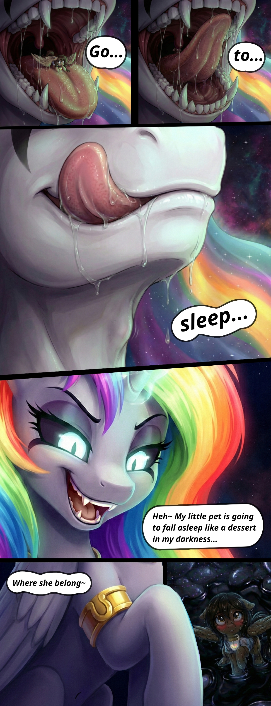

# Rainbow Queen and Yasmin: Go to Sleep

### Attention! The content you will read below will contain vore (medium level)!

This content will need to say chapter 3 spoilers.

[spoiler:3:1901]
## About the sketch

This is a drawing sketch made using AI. This material is not the final version of the image, this is a sketch made through AI to help me to draw the final art development using my own lineart and art style.

All the images of the comic were generated separately, the whole idea of the characters' position was idealized by me (Yasmin Seidel), and the script was fully written by me (Yasmin Seidel).

All images of the sketch were generated by Google Gemini (Nano Banana), and edited by me (JasminDreasond). The creation of the comic interface was also made by me.

All images were edited to make corrections to the visuals generated by AI, but this is not the final version, and yes to improve the reference in time to actually make the drawing.

Some features of the images are incorrect (Especially the design of characters that does not match their official versions in the official wiki). They will be fully corrected when drawn by an artist.

The images of this folder are not to be posted as official content because everything here is stored to be WIP version! This place is especially a storage of ideas of a work that is in development.

## Idea

The idea of dialogue is that the first 3 images represent that each image is Rainbow Queen pronouncing a word (which causes the movement of her tongue where Yasmin is present). When she says "sleep", it is where the tongue movement from word "sleep" naturally makes Rainbow Queen close her mouth, she uses this combination of closing the mouth for purpose to swallow Yasmin during the silly moment in wishing Yasmin will go to sleep.

This image communicates with the canonical part of Pony Driland in chapter 3 that Yasmin is already a Rainbow Queen pet, and Rainbow Queen is having fun with her. 

In the official story Rainbow Queen likes to make Yasmin sleep inside her tummy (Rainbow Queen likes to say provocatively that the words "my darkness" is her stomach for fun, symbolizing that she likes to be a dark creature), because Rainbow Queen found out Yasmin is the only character in her friendships who likes safe vore.

Rainbow Queen with this information obtained after spying on Yasmin's cell phone, she feels safe that in the end Yasmin will feel good when she realizes that this game even being scary, in the end nothing bad will really about it, because the other friends have an extremely higher level of fear in sleeping inside the belly of Rainbow Queen.

Yasmin does not know this because she is still being consumed by terror, but at the time she accepts the fate of sleeping inside the belly of Rainbow Queen for the first time in her life, and chooses this place as a safe place to try to protect her awareness of the fear of the unknown is that it activates the trigger that Rainbow Queen discovers that for the first time someone accepts sleeping inside her stomach, which makes her feel very happy, and wish that Yasmin remains being her pet.

## Comic Dialogues

Image 1: go...

Image 2: to...

Image 3: sleep~

Image 4: Heh~ My little pet will fall asleep in my darkness...

Image 5: Where her belong~

## The comic image

[/spoiler]
