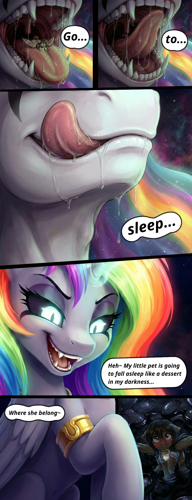

# Rainbow Queen and Yasmin: Go to Sleep

### Attention! The content you will read below will contain vore (medium level)!

This content will need to say chapter 3 spoilers.

[spoiler:3:1901]
## About the sketch

This is a drawing sketch made using AI. This material is not the final version of the image; this is a sketch made through AI to help me draw the final art development using my own lineart and art style.

All the images of the comic were generated separately. The whole idea of the characters' positions was idealized by me (Yasmin Seidel), and the script was fully written by me (Yasmin Seidel).

All images of the sketch were generated by Google Gemini (Nano Banana), and edited by me (JasminDreasond). The creation of the comic interface was also made by me.

All images were edited to make corrections to the visuals generated by AI, but this is not the final version, and yes to improve the reference in time to actually make the drawing.

Some features of the images are incorrect (Especially the design of characters that does not match their official versions in the official wiki). They will be fully corrected when drawn by an artist.

The images of this folder are not to be posted as official content because everything here is stored to be WIP version! This place is especially a storage of ideas of a work that is in development.

## Idea

The idea of the dialogue is that the first 3 images represent that each image is Rainbow Queen pronouncing a word (which causes the movement of her tongue where Yasmin is present). When she says "sleep", it is where the tongue movement from the word "sleep" naturally makes Rainbow Queen close her mouth; she uses this combination of closing the mouth for the purpose of swallowing Yasmin during the silly moment of wishing Yasmin will go to sleep inside her "darkness".

This comic communicates with the canonical part of Pony Driland in chapter 3, where Yasmin is already a Rainbow Queen pet, and Rainbow Queen is having fun with her before the Yasmin's sleep time. Due to her Sphinx nature, Rainbow Queen possesses innate feline predator instincts. In a familiar and close-knit setting, these instincts manifest not as a desire to hunt, but as a unique way of bonding: she enjoys 'preying' on her friends as a form of intimacy.

In the official story, Rainbow Queen likes to make Yasmin sleep inside her tummy (Rainbow Queen likes to say provocatively that the words "my darkness" refer to her stomach for fun, symbolizing that she likes to be a dark creature), because Rainbow Queen found out Yasmin is the only creature in her friendships who accepts being devoured alive safely, making one of her contained feelings finally be free. She discovered that only Yasmin accepts the deepest side of these feline instincts.

With this information obtained after spying on Yasmin's cell phone, Rainbow Queen feels happy that in the end Yasmin will feel safe when she realizes that this moment, even being scary, in the end, nothing bad will really happen, because the other friends have an extremely higher level of fear of sleeping inside the belly of Rainbow Queen.

Yasmin does not know this yet because she is still consumed by terror. However, the moment she accepts her fate of sleeping inside Rainbow Queen’s belly for the first time and chooses it as a safe place to protect herself from depression and the fear of the unknown, it triggers a realization for Rainbow Queen. She realizes that, for the first time, someone has accepted sleeping inside her stomach, which makes her feel very happy and wishes for Yasmin to remain her pet and to repeat this moment in the coming nights.

## Comic Dialogues (and script)

The Rainbow Queen is in a dark void dimension.

Image 1: Dialogue: go...

Image 2: Dialogue: to...

Image 3: Dialogue: sleep~

Image 3.1: X-Ray body slides down (continues the cute reaction face of image 3).

Image 4: Heh~ My little pet is going to fall asleep like a dessert in my darkness...

Image 5: Where she belong~

Image 6: Black Image with the text: Some minutes later

Image 7: `./reference-test/Gemini_Generated_Image_kwxuyukwxuyukwxu.png` (Zoom focus in the character on the bed only).
Ignores the ice environment, Rainbow Queen usually sleeps in a dimension that functions as a dream controlled by her, so instead of a cold place, it can be a bed floating in the dark void.

Image 8: Continuation of image 7 with a zoom on the character's belly, showing the more detailed belly (and a darker environment as the wings are covering the belly) with a text just indicating the sounds in a smooth cute way, but the scene is focused.

Image 7/1: X-Ray
`public/img/wallpaper/ai/where-you-belong/1080.png`

This image is a good reference to see the belly behind the wings (Images without wings to see the belly).
`./reference-test/Gemini_Generated_Image_ovc92iovc92iovc9.png`

## The comic image

`./reference-test/Gemini_Generated_Image_kwxuyukwxuyukwxu.png`

`./reference-test/Gemini_Generated_Image_ovc92iovc92iovc9.png`

[/spoiler]
